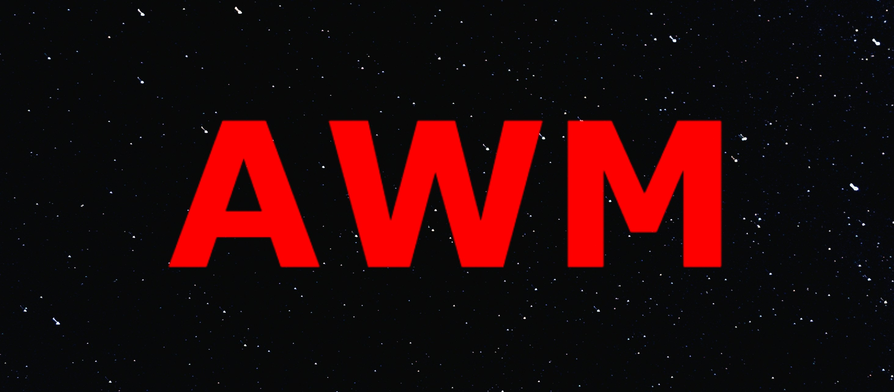

# Ahmed — Portfolio

Welcome to my portfolio.

This repository contains my personal portfolio, where I showcase the projects I build, the technologies I work with, and the things I learn along the way.

I enjoy turning ideas into real, usable products and continuously improving my skills by building projects across web development, software, AI, and other areas of technology.

## Preview

## Portfolio

You can explore my projects, skills, and work through my portfolio:

**[Visit my Portfolio](https://ahmeedn.github.io/AWM-PRO/)**

## About Me

I'm a developer who enjoys building things, experimenting with new technologies, and learning through practical projects.

This portfolio is a collection of my work and a reflection of my progress as I continue developing my skills.

## What I Work With

* JavaScript
* TypeScript
* React
* Next.js
* Python
* Node.js
* Databases
* AI & AI-powered applications
* Web Development

## Projects

The portfolio includes a variety of projects I've built while learning and experimenting with different technologies.

Each project represents a different idea, challenge, or skill I've worked on.

## Links

**Portfolio:**
https://ahmeedn.github.io/AWM-PRO/

**GitHub:**
https://github.com/ahmeedn

---

Made by **Ahmed**
